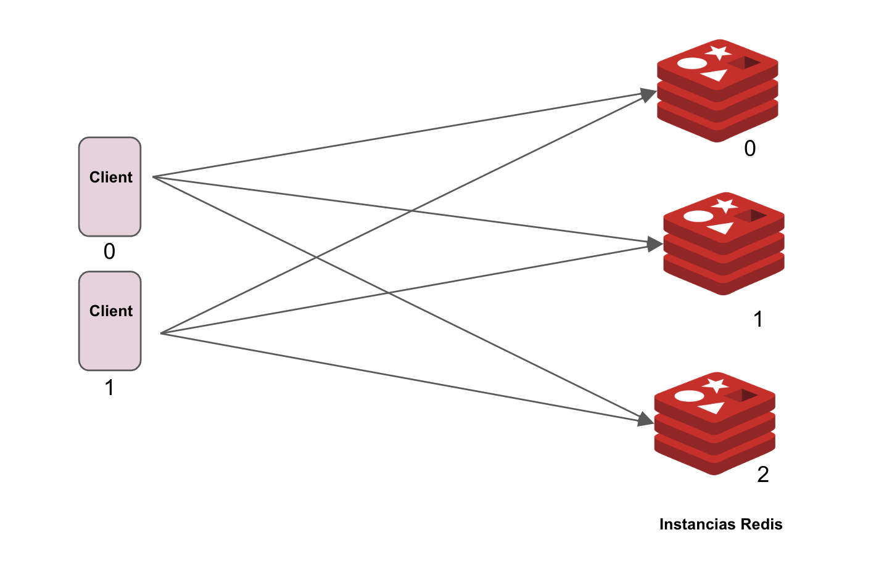

# cli-naive-replication: an (unsuccessful) attempt to keep in sync three redis databases
`cli-naive-replication` es implementado para evidenciar el problema de inconsistencias que surge en un ambiente
distribuido compuesto por al menos 2 clientes y un grupo de nodos de almacenamiento. 

El problema es que no se puede garantizar que los datos en diferentes nodos de bases de datos estén
siempre en sincronía. En sistemas distribuidos, este problema de inconsistencias es muy común sin embargo es difícil
de resolver y requiere la inclusión de un protocolo State Machine Replication (SMR) el cual no es aplicado en 
esta implementación. 

El objetivo de esta implementación es comprender de forma experimental el problema de inconsistencias 
que surge en un intento de replicación que no incluye un protocolo SMR. Así mismo, evaluamos 
el rendimiento (throughput y latencia) de las operaciones de escritura y lectura a este 
servicio el cual denominamos **Escenario sin SMR**. Por otro lado implementamos el mismo servicio de
almacenamiento con SMR Rabia (**Escenario con SMR**) y realizamos una comparación de consistencia y 
rendimiento en ambos escenarios.

# Escenarios de evaluación
Se cuentan con dos escenarios de evaluación: para el escenario sin protocolo SMR, el servicio de almacenamiento llave-valor
cuenta con la implementaciónn presentada en [este repositorio](https://github.com/angelmotta/cli-naive-replication)
el cual consiste de un programa cliente el cual *intenta* mantener sincronizado el estado de las 3 nodos del servicio.
El código fuente para el *Escenario con SMR* se encuentra en el repositorio [angelmotta/rabia](https://github.com/angelmotta/rabia/tree/test-rabia)
el cual es un *fork* del repositorio oficial de [Rabia](https://github.com/haochenpan/rabia) el cual incluye
algunas personalizaciones para evaluar *Rabia* en un entorno de contenedores Docker para un despliegue
más sencillo y realizar pruebas iniciales de forma más ágil.

## Evaluación de consistencia
El escenario para esta evaluación esta compuesto de la siguiente forma:
- 3 nodos (replicas) del servicio de almacenamiento basado en Redis.
- 2 clientes conectados al servicio de almacenamiento.

En el *Escenario sin SMR* y el *Escenario con SMR* los 2 clientes envían al servicio de almacenamiento solicitudes
de escritura y lectura de forma aleatoria y simultanea.

||
|:--:| 
| *Escenario sin SMR* |

## Evaluación de rendimiemnto
Se utilizaron 3 nodos de almacenamiento basados en Redis. Para la evaluación rendimiento cada nodo es ejecutado en VMs separadas en AWS EC2.
Considerando las opciones disponibles de capacidad en la nueva AWS, seleccionamos que cada nodo cuenta con las siguientes recursos de computo:
- 2 CPUs
- 8 GB de RAM.

Al momento de la evaluación, esta fue la opción más económica disponible para contar con una VM con al menos 2 CPUs, 
el cual es un recurso necesario para que cada nodo del servicio de almacenamiento pueda atender múltiples solicitudes de clientes.
